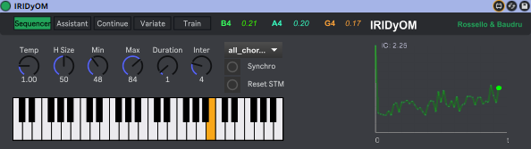
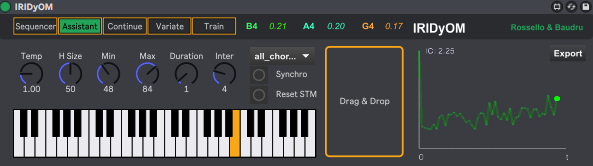
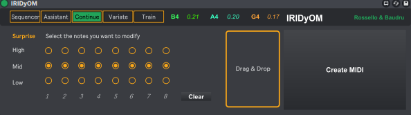
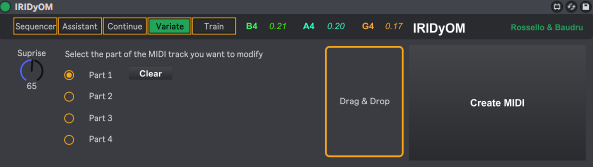
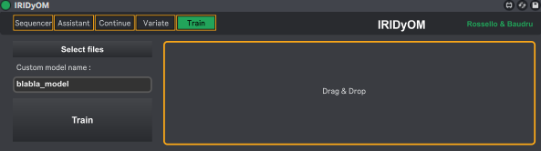

# IRIDyOM

IRIDyOM is a Max for Live device (`IRIDyOM.amxd`) with a companion server (`main.py`) for MIDI analysis, prediction, continuation, variation, and training.

## Install / Run

### Windows (installer)
1. Run `IRIDyOM-Setup.exe`.
2. In Ableton Live, drag & drop the Max device from:
   - `C:\VST\IRIDyOM\IRIDyOM.amxd`

### macOS (run the server)
1. Install Python dependencies:
   ```bash
   python3 -m pip install -r requirements.txt
   ```
2. Start the server:
   ```bash
   python3 main.py
   ```
3. Open Ableton Live and load `IRIDyOM.amxd` (from this repo).

> Note: In all cases, keep `IRIDyOM.amxd` in the same folder as the JS files it depends on: `jsui_ic_plot.js`, `listen.js`, and `midi_to_note.js`.

## Modes (screenshots)

### 1) Sequencer
Autonomous generation mode.
- Streams generated notes to Ableton Live at the current tempo.
- Uses the current history (STM), MIDI range, and sampling settings (e.g., temperature / probabilistic selection).



### 2) Assistant
Interactive suggestion mode.
- You play notes; IRIDyOM returns ranked next-note candidates.
- Designed to support real-time exploration (and can compute per-note surprisal / IC during analysis).



### 3) Continue
Continuation from an existing MIDI phrase.
- Analyze a MIDI clip/file note-by-note (including information content per note).
- Generate and export a continued MIDI file based on the analyzed material.



### 4) Variate
Generate variations from an analyzed phrase.
- Create variations of a selected part of the last analyzed MIDI.
- Control how “surprising” the variation is, then export the resulting MIDI.



### 5) Train
Create your own model from your material.
- Record training sequences and/or add MIDI files.
- Configure training optionsthen train.



## Citation

```bibtex

```
